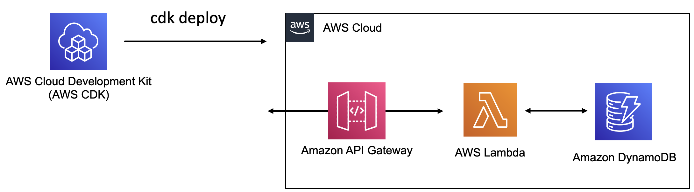

# Build and deploy a Serverless application with Go, AWS Lambda, DynamoDB and AWS CDK



- [Part 1](part1) - Start off with a simple AWS Lambda function using Go - hello world!
- [Part 2](part2) - Bring DynamoDB into the mix! Update the Lambda function to use the DynamoDB Go SDK and persist data in a DynamoDB table
- [Part 3](part3) - Finally, use [AWS CDK](https://docs.aws.amazon.com/cdk/v2/guide/work-with-cdk-go.html) to manage your Infra-as-code with AWS CDK.

### Build, deploy and test

**Part 1 - Hello world function**

Build and package:

```bash
cd part1

# build
GOOS=linux go build -o hello .

# package
zip func.zip hello
```

- Navigate to AWS console > Lambda
- Create new Lambda function (Go 1.x runtime), upload the zip file
- Test using the console (use `AWS API Gateway Proxy` as the payload type and set `isBase64Encoded` attribute to `false`).

**Part 2 - Persist data to DynamoDB**

```bash
cd part2

# build
GOOS=linux go build -o hello .

# package
zip func.zip hello
```

- Navigate to AWS console > Lambda
- Upload the zip file for the existing function
- Create DynamoDB table - use `email` as the Partition key (data type `String`)
- Add an environment variable to the Lambda function with name `TABLE_NAME` and value as the name of the DynamoDB table you created
- Update the Lambda Function IAM role to provide DynamoDB `PutItem` permission for the DynamoDB table you created
- - Test using the console (use `AWS API Gateway Proxy` as the payload type and set `isBase64Encoded` attribute to `false`). Use a JSON payload e.g. `{\"email\":\"user1@foo.com\",\"name\":\"user1\"}`
- Confirm that the user entry was added to DynamoDB table

**Part 3 - Infra-as-code with AWS CDK**

```bash
cd part3

# to see the CloudFormation template
cdk synth

# to deploy the stack (enter y to confirm)
cdk deploy
```

- Navigate to AWS console > CloudFormation and confirm that the stack was successfully created and all resources were provisioned (Lambda Function, DynamoDB table, IAM role and permission)
- Test using the console (use `AWS API Gateway Proxy` as the payload type and set `isBase64Encoded` attribute to `false`). Use a JSON payload e.g. `{\"email\":\"user1@foo.com\",\"name\":\"user1\"}`
- Confirm that the user entry was added to the *new* DynamoDB table

### Resources

**Go packages used:**

- `events` - https://pkg.go.dev/github.com/aws/aws-lambda-go/events
- `lambda` - https://pkg.go.dev/github.com/aws/aws-lambda-go/lambda
- `API Gateway`[request](https://pkg.go.dev/github.com/aws/aws-lambda-go/events#APIGatewayV2HTTPRequest) and [response](https://pkg.go.dev/github.com/aws/aws-lambda-go/events#APIGatewayV2HTTPResponse) 
- DynamoDB [PutItem](https://pkg.go.dev/github.com/aws/aws-sdk-go/service/dynamodb?utm_source=gopls#DynamoDB.PutItem) API call 
- [Amazon DynamoDB Construct Library](https://pkg.go.dev/github.com/aws/aws-cdk-go/awscdk/v2/awsdynamodb)
- [AWS Lambda Construct Library](https://pkg.go.dev/github.com/aws/aws-cdk-go/awscdk/v2/awslambda)

**Others:**

- Lambda Handler signatures - https://docs.aws.amazon.com/lambda/latest/dg/golang-handler.html
- Lambda error handling - https://docs.aws.amazon.com/lambda/latest/dg/golang-exceptions.html#go-exceptions-how
- API Gateway
  - Lambda integration - https://docs.aws.amazon.com/lambda/latest/dg/services-apigateway.html
  - HTTP support https://docs.aws.amazon.com/apigateway/latest/developerguide/api-gateway-basic-concept.html
- CDK
  - General https://docs.aws.amazon.com/cdk/v2/guide/home.html
  - CDK Go https://docs.aws.amazon.com/cdk/v2/guide/work-with-cdk-go.html
- Amazon Lambda Golang Library (*L2 construct in experimental phase at the time of writing*)
  - [Go function structure](https://pkg.go.dev/github.com/aws/aws-cdk-go/awscdklambdagoalpha/v2#readme-go-function)
  - [Bundle your Go function using go tooling](https://pkg.go.dev/github.com/aws/aws-cdk-go/awscdklambdagoalpha/v2#readme-local-bundling)
  - [Use Docker to bundle your Go function code](https://pkg.go.dev/github.com/aws/aws-cdk-go/awscdklambdagoalpha/v2#readme-docker)
